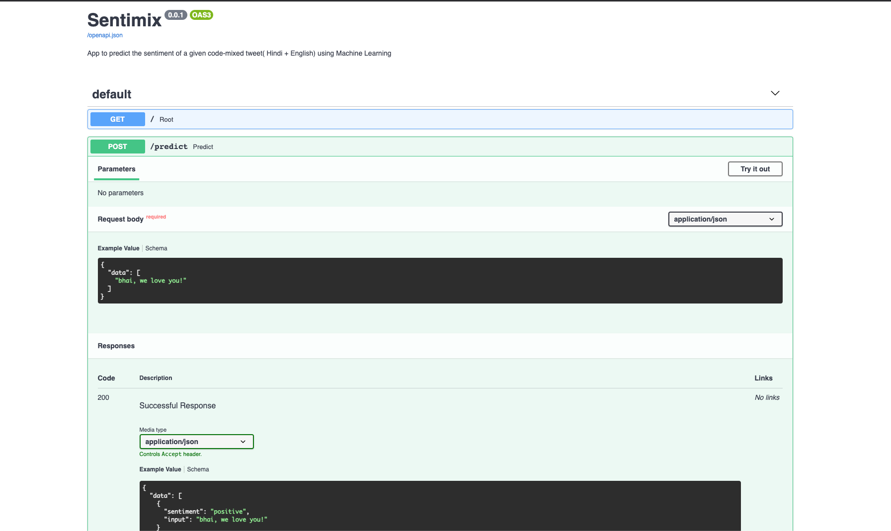

# [Sentimix Challenge](https://competitions.codalab.org/competitions/20654)
- The task is to predict the sentiment of a given code-mixed tweet. The sentiment labels are positive, negative, or neutral, and the code-mixed languages will be English-Hindi.
# Contents
This repo will cover the following things in their corresponding notebooks:
- 1. Data Exploration and Visualization
- 2. Classic ML models for baseline
- 3. Transformer based Deep Learning models 
- 4. Testset Evaluation Reports

This repo also has api code to serve the models through a rest API. See below for more details.

## Usage

Clone this repo:

```
git clone https://github.com/moinudeen/sentimix.git
cd sentimix
```

Install the dependencies:

```
pip install -r requirements.txt
```

To explore and visualize data, run this notebook: [Data_Exploration_Demo](https://github.com/moinudeen/sentimix/blob/main/src/1_Data_Exploration_Demo.ipynb) 

To train baseline ML models, run this notebook: [Classical_ML_Models_Demo](https://github.com/moinudeen/sentimix/blob/main/src/2_Classical_ML_Models_Demo.ipynb) 

To train deep transformer models, run this notebook: [Transformer_Models_Demo](https://github.com/moinudeen/sentimix/blob/main/src/3_Transformer_Models_Demo.ipynb) 

Finally, Take a look at the results of this experiment here: [Testset_Evaluation_Report](https://github.com/moinudeen/sentimix/blob/main/src/4_Testset_Evaluation_Report.ipynb) 

Once you have trained your models, you can deploy them for real time inference.


To deploy the trained model in an app, please follow the steps below:
```
cd src/
uvicorn api.main:app --reload
```

The model is deployed by using FastAPI and uvicorn. Go to `http://127.0.0.1:8000/docs` to see api documentation. 



For Simplicity, only the Logistic regression model has been uploaded to this repo. 
You can update the api endpoint to point to your own trained model by changing the path value in `src/api/model_registry.json`
